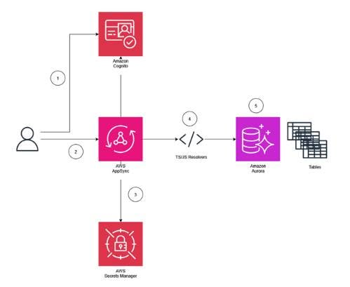

## [Góc Case Study] Giải bài toán quản lý chuỗi cung ứng ngành Ô tô bằng bộ đôi Serverless: AWS AppSync & Amazon Aurora

Trong ngành công nghiệp ô tô, chỉ cần thiếu một linh kiện nhỏ là cả dây chuyền sản xuất có thể phải đứng im. Việc quản lý chuỗi cung ứng theo thời gian thực (real-time) đang là một nhu cầu cấp bách. Bài viết này sẽ tóm tắt một Case Study rất hay từ AWS: Kết hợp **AWS AppSync** và **Amazon Aurora Serverless** để giải bài toán này với điểm tối ưu tuyệt đối về hiệu năng và chi phí.

---

## Kiến trúc giải pháp

Dưới đây là mô hình luồng xử lý và giao tiếp giữa các dịch vụ trong hệ thống chuỗi cung ứng:

> _Hình 1. Kiến trúc tổng thể: Amazon Cognito xác thực người dùng, AWS AppSync giao tiếp qua TS/JS Resolvers xuống Amazon Aurora, được bảo mật bởi AWS Secrets Manager._

## 

## Các điểm nhấn kỹ thuật cốt lõi

### 1. Kiến trúc co giãn tự động (Auto-scaling)

Hệ thống sử dụng **Amazon Cognito** để xác thực, **AWS AppSync** làm cổng giao tiếp GraphQL API và lưu trữ dữ liệu quan hệ trên cơ sở dữ liệu **Amazon Aurora Serverless**.

Sự kết hợp này giúp hệ thống tự động mở rộng (scale up) để xử lý mượt mà khi lượng đơn hàng linh kiện tăng đột biến, đồng thời tự động thu nhỏ (scale down) khi có ít tương tác nhằm tiết kiệm tối đa chi phí hạ tầng.

### 2. Xử lý logic trực tiếp tại tầng API

Đây là điểm ấn tượng nhất của kiến trúc. Thay vì gọi qua một dịch vụ trung gian như AWS Lambda để thực thi tính toán, kiến trúc này sử dụng trực tiếp **JavaScript resolvers** ngay bên trong AppSync.

Các nghiệp vụ tính toán phức tạp trong quản lý chuỗi cung ứng được xử lý chớp nhoáng tại tầng API, bao gồm:

- **Lead Time** (Thời gian chờ hàng)
- **Backorder Rate** (Tỷ lệ hụt hàng)
- **Order Fill Rate** (Tỷ lệ đáp ứng đơn hàng)

Việc này không chỉ giúp giảm thiểu đáng kể độ trễ (latency) mà còn bớt đi một tầng dịch vụ trung gian cần phải quản lý.

### 3. Quản lý kết nối cơ sở dữ liệu an toàn không tì vết

Để AppSync có thể truy xuất trực tiếp vào Database mà không làm lộ lọt thông tin nhạy cảm, **AWS Secrets Manager** được tích hợp vào quy trình. Dịch vụ này đảm nhận vai trò lưu trữ thông tin đăng nhập và cấp quyền an toàn, đảm bảo tuân thủ chặt chẽ các nguyên tắc bảo mật của hệ thống.

---

## Tài liệu tham khảo & Thảo luận

Bạn có thể nghiên cứu chi tiết bài viết gốc và kiến trúc đầy đủ tại Blog chính thức của AWS:
[Building a serverless supply chain management solution for automotive customers with AWS AppSync and Amazon Aurora Serverless](https://aws.amazon.com/vi/blogs/industries/building-a-serverless-supply-chain-management-solution-for-automotive-customers-with-aws-appsync-and-amazon-aurora-serverless/)
