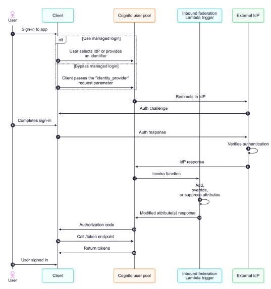

# Customizing Federated Sign-In with the Inbound Federation Lambda Trigger in Amazon Cognito

When building applications that allow users to authenticate through third-party Identity Providers (IdPs) such as **Google**, **Facebook**, **OIDC**, or **SAML**, one common challenge is handling inconsistent user data returned by different providers. This inconsistency can result in duplicate user accounts or unnecessary user attributes being stored in the system.

To address this issue, AWS introduced the **Inbound Federation Lambda Trigger** for Amazon Cognito. This feature allows developers to intercept the authentication flow immediately after Cognito receives user information from an IdP but before the user profile is created or updated in the User Pool.

---

## Authentication Flow

**Figure 1. Authentication flow using the Inbound Federation Lambda Trigger.**

The authentication process consists of the following steps:

1. A user accesses the application and chooses to sign in using an Identity Provider (Google, Facebook, SAML, OIDC, etc.).
2. Amazon Cognito redirects the user to the selected Identity Provider for authentication.
3. After successful authentication, the Identity Provider returns user claims and attributes to Amazon Cognito.
4. Before Cognito creates or updates the user profile, the **Inbound Federation Lambda Trigger** is invoked.
5. The Lambda function can then:
   - Add new user attributes.
   - Modify existing attribute values.
   - Normalize incoming user data.
   - Remove unnecessary attributes.
   - Link the federated identity to an existing Cognito user.
6. Amazon Cognito completes the authentication process and returns an Authorization Code or Access Token to the client application.

Because the Lambda function is executed before the user profile is stored, developers gain full control over how user information is processed and persisted.

---

## Purpose of the Inbound Federation Lambda Trigger

Unlike traditional Cognito Lambda Triggers that operate after a user has already been created, the **Inbound Federation Lambda Trigger** executes during the federation process itself.

This enables developers to solve several common identity management challenges without introducing additional middleware or custom authentication services.

Its primary capabilities include:

- Normalizing user data from multiple Identity Providers.
- Adding or overriding user attributes.
- Removing unnecessary attributes.
- Identifying and linking existing user accounts.
- Preventing redundant data from being stored in the Cognito User Pool.

---

# B2B Use Case

In enterprise environments, organizations commonly use **SAML Identity Providers** such as Microsoft Entra ID (Azure AD), Okta, or ADFS.

These providers often return a large number of user attributes, including hundreds of group memberships.

For example:

- Department
- Organization
- Hundreds of Security Groups
- Cost Center
- Region
- Employee Type

If all these attributes are stored directly in Amazon Cognito, the combined attribute size may exceed the **2048-character limit**, causing the authentication request to fail.

The Inbound Federation Lambda Trigger enables developers to:

- Remove unnecessary groups.
- Normalize group names.
- Retain only the groups required for authorization.

As a result, organizations can:

- Reduce the amount of stored user data.
- Prevent authentication failures.
- Simplify permission management.

---

# B2C Use Case

A common scenario in consumer-facing applications occurs when a user initially registers with an email and password, then later signs in using a social login provider such as Google or Facebook.

For example:

**Account A**

- Email: example@gmail.com
- Authentication method: Email and Password

Later, the user selects:

- Sign in with Google

Without additional processing, Amazon Cognito creates:

**Account B**

- Email: example@gmail.com
- Provider: Google

This leads to several problems:

- Duplicate accounts for the same individual.
- Fragmented transaction history.
- Increased complexity in customer data management.

Using the Inbound Federation Lambda Trigger, developers can:

- Check whether the email address already exists.
- Locate the corresponding user in the Cognito User Pool.
- Automatically perform **Account Linking** between the existing account and the new federated identity.

After linking:

- The user has only one account.
- Multiple sign-in methods can be used interchangeably.
- User profiles, preferences, and transaction history remain centralized.

---

# Operations Supported by the Lambda Trigger

During execution, the Lambda function can perform several data transformation tasks, including:

- Adding new attributes.
- Overriding existing attributes.
- Removing unnecessary attributes.
- Normalizing display names.
- Standardizing email addresses.
- Transforming attribute formats.
- Linking federated identities to existing users.

Example:

| Attribute from IdP    | Processed Result   |
| --------------------- | ------------------ |
| John DOE              | John Doe           |
| SALES-HCM             | Sales              |
| employee@gmail.com    | employee@gmail.com |
| 350 Group Memberships | 5 Essential Groups |

---

# Benefits of the Inbound Federation Lambda Trigger

The introduction of this Lambda Trigger provides several significant benefits:

- Ensures consistent user data across multiple Identity Providers.
- Prevents duplicate user accounts.
- Gives developers complete control over user attributes before they are stored.
- Supports automatic account linking.
- Simplifies authorization and reporting through standardized attributes.
- Improves the overall user sign-in experience.

---

# Implementation Considerations

When implementing this feature, several best practices should be considered:

- The Lambda function should complete execution within **5 seconds** to avoid delaying the authentication process.
- Proper exception handling should be implemented to ensure that Lambda errors do not unintentionally block legitimate login attempts.
- Only modify attributes that are necessary to minimize processing time.
- When performing account linking, ensure that user identities are verified carefully to prevent incorrect account associations.

---

# Conclusion

The **Inbound Federation Lambda Trigger** is a valuable enhancement to Amazon Cognito for applications that rely on federated authentication. By allowing developers to intercept and modify user information before Cognito creates or updates a user profile, this feature effectively addresses challenges such as inconsistent identity data, duplicate accounts, and unnecessary attribute storage.

For **B2B** applications, it helps filter and normalize SAML attributes returned by enterprise Identity Providers. For **B2C** applications, it enables seamless account linking across multiple authentication methods, ensuring that user information remains centralized and consistent while providing a better authentication experience.

---

## References

- AWS Security Blog. _Customize federated sign-in with the new Amazon Cognito Inbound Federation Lambda Trigger._ https://aws.amazon.com/vi/blogs/security/customize-federated-sign-in-with-new-amazon-cognito-lambda-trigger/
