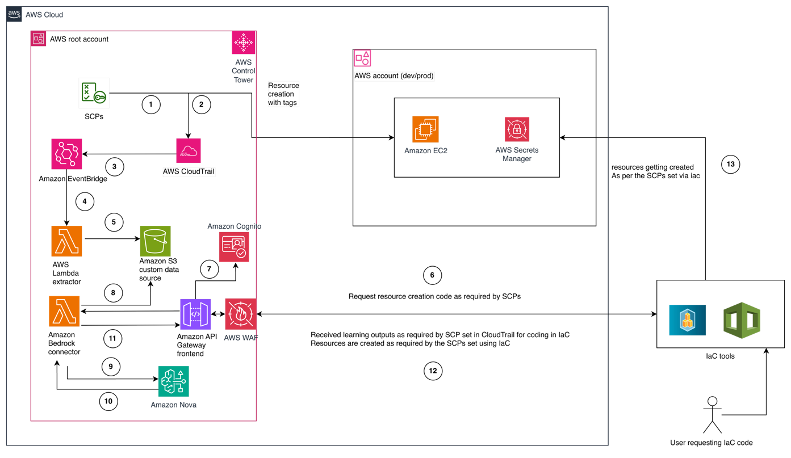

# Using Generative AI to Automatically Generate Infrastructure as Code (IaC) Compliant with Service Control Policies Using Amazon Bedrock

**Infrastructure as Code (IaC)** has become an essential practice in cloud infrastructure management, enabling organizations to provision and configure cloud resources through code instead of manual operations. Popular IaC tools such as **Terraform** and **AWS CloudFormation** improve deployment consistency, automation, and scalability.

However, for organizations using **AWS Organizations**, every deployed resource must comply with the organization's **Service Control Policies (SCPs)**. These policies define the maximum permissions available to AWS accounts. Manually writing or reviewing Infrastructure as Code to comply with SCPs is often time-consuming, error-prone, and may introduce security risks.

To address this challenge, AWS introduced an architecture that combines **Amazon Bedrock** with several serverless AWS services to automatically generate Infrastructure as Code from natural language requests while ensuring that the generated code complies with organizational policies.

---

# Solution Architecture

**Figure 1. Overall architecture of the system for generating Infrastructure as Code compliant with Service Control Policies.**

The solution consists of two primary workflows:

1. Service Control Policy synchronization.
2. Infrastructure as Code generation using Generative AI.

These workflows work together to ensure that every generated Infrastructure as Code template is based on the latest version of the organization's Service Control Policies.

---

# Service Control Policy Synchronization

In practice, **Service Control Policies (SCPs)** are frequently updated as organizations introduce new security requirements or modify governance rules.

Instead of manually updating the AI system whenever policies change, this architecture automatically synchronizes policy updates using several AWS services.

The workflow operates as follows:

1. An administrator creates or updates a Service Control Policy.
2. AWS CloudTrail records the policy change event.
3. Amazon EventBridge detects the event.
4. EventBridge triggers an AWS Lambda function.
5. Lambda retrieves the updated Service Control Policy.
6. The latest policy is stored in Amazon S3.

As a result, the policy repository remains up to date and is always available as a reference when generating Infrastructure as Code.

---

# Infrastructure as Code Generation Workflow

When developers need to provision new infrastructure, they simply describe their requirements using natural language.

For example:

> "Create a secure Amazon S3 bucket for storing application logs."

The generation process consists of the following steps:

1. The user submits the request through an API exposed by Amazon API Gateway.
2. API Gateway invokes an AWS Lambda function.
3. Lambda retrieves the latest Service Control Policies from Amazon S3.
4. The user's request is combined with the organization's policies to create a complete prompt.
5. The prompt is sent to Amazon Bedrock.
6. The Foundation Model analyzes both the infrastructure requirements and the applicable security policies.
7. Amazon Bedrock generates Infrastructure as Code (for example, Terraform) that satisfies the requested functionality while complying with the organization's Service Control Policies.
8. The generated Infrastructure as Code is returned to the user.

By providing the Foundation Model with the organization's governance policies as context, the generated Infrastructure as Code is more likely to be compliant on the first attempt, significantly reducing manual revisions.

---

# Role of Amazon Bedrock

Amazon Bedrock provides access to multiple **Foundation Models** through APIs without requiring developers to manage machine learning infrastructure.

Within this architecture, Amazon Bedrock is responsible for:

- Understanding infrastructure requirements described in natural language.
- Interpreting the organization's Service Control Policies.
- Combining user requirements with governance policies.
- Generating Infrastructure as Code that satisfies both functional and compliance requirements.
- Recommending configurations that follow AWS best practices.

Amazon Bedrock can therefore be viewed as an intelligent AI assistant that accelerates Infrastructure as Code development while ensuring compliance with organizational governance policies.

---

# Benefits of Automatic Service Control Policy Synchronization

One of the major advantages of this solution is its ability to automatically synchronize policy updates.

Whenever an administrator modifies a Service Control Policy:

- AWS CloudTrail records the update.
- Amazon EventBridge automatically detects the event.
- AWS Lambda processes the updated policy.
- Amazon S3 stores the latest version.

This ensures that:

- Every Infrastructure as Code generation request uses the most recent organizational policies.
- Manual prompt updates are no longer necessary.
- The risk of using outdated governance rules is minimized.

---

# Security Architecture

Security is integrated throughout the entire solution.

## Amazon Cognito

Amazon Cognito authenticates users and manages identities before they are allowed to access the Infrastructure as Code generation service.

Its primary responsibilities include:

- User authentication.
- Identity management.
- Access control.
- API protection.

Only authorized users can submit requests to the system.

---

## AWS WAF

AWS WAF is deployed in front of Amazon API Gateway to protect the public API from Internet-based attacks.

AWS WAF helps mitigate:

- SQL Injection.
- Cross-Site Scripting (XSS).
- Malicious HTTP requests.
- Bot attacks.
- Distributed Denial-of-Service (DDoS) attacks.

This additional security layer helps protect the AI-powered service from common web threats.

---

# Benefits of the Solution

Compared with manually developing Infrastructure as Code, this solution offers several advantages:

- Automatically generates Infrastructure as Code from natural language.
- Ensures compliance with organizational Service Control Policies.
- Automatically adapts to policy updates.
- Reduces infrastructure development time.
- Minimizes human errors.
- Strengthens cloud governance.
- Enhances overall security.
- Accelerates infrastructure deployment.

---

# Implementation Considerations

To maximize the effectiveness of this solution, several best practices should be followed:

- Keep Service Control Policies synchronized so the AI always references the latest governance rules.
- Design prompts carefully to improve the quality of generated Infrastructure as Code.
- Review and validate generated templates before deploying them to production environments.
- Apply the **Principle of Least Privilege** to all AWS Lambda IAM roles.
- Enable Amazon CloudWatch for logging and monitoring.
- Protect public APIs using Amazon Cognito and AWS WAF.

---

# Conclusion

Combining **Amazon Bedrock** with AWS serverless services provides an effective solution for automatically generating **Infrastructure as Code** that complies with organizational **Service Control Policies**.

Through continuous policy synchronization using **AWS CloudTrail**, **Amazon EventBridge**, **AWS Lambda**, and **Amazon S3**, the system always references the latest organizational governance rules during Infrastructure as Code generation. Developers simply describe their infrastructure requirements in natural language, and Amazon Bedrock analyzes the request, combines it with the latest Service Control Policies, and produces compliant Infrastructure as Code.

This architecture not only improves developer productivity but also strengthens cloud governance, reduces deployment risks, and incorporates security considerations into the infrastructure design process from the very beginning.

---

# AWS Services Used

| AWS Service        | Purpose                                                                       |
| ------------------ | ----------------------------------------------------------------------------- |
| Amazon Bedrock     | Generates Infrastructure as Code using Foundation Models                      |
| AWS Lambda         | Processes Service Control Policy updates and communicates with Amazon Bedrock |
| AWS CloudTrail     | Records Service Control Policy changes                                        |
| Amazon EventBridge | Detects Service Control Policy update events                                  |
| Amazon S3          | Stores the latest Service Control Policies                                    |
| Amazon API Gateway | Provides APIs for users to submit infrastructure requests                     |
| Amazon Cognito     | Authenticates and authorizes users                                            |
| AWS WAF            | Protects the API against web attacks                                          |
| Terraform          | Infrastructure as Code tool used for AI-generated templates                   |

---

# References

- AWS Infrastructure & Automation Blog. _Using generative AI for proactive IaC code generation that's compliant with Service Control Policies using Amazon Bedrock._  
  https://aws.amazon.com/vi/blogs/infrastructure-and-automation/using-generative-ai-for-proactive-iac-code-generation-thats-compliant-with-service-control-policies-using-amazon-bedrock/
